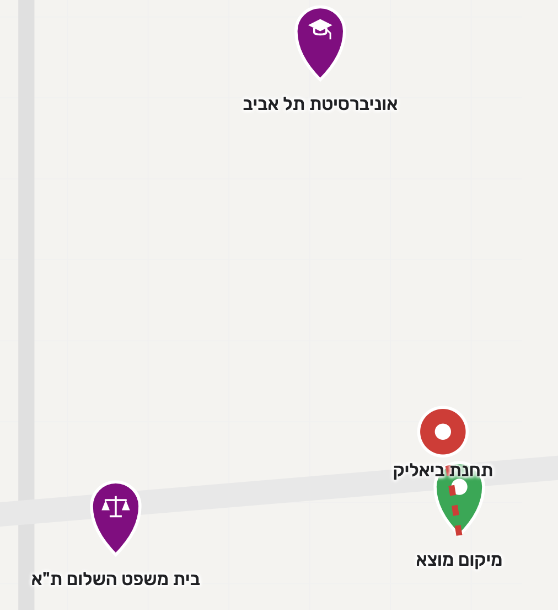

#  Location Inspector

## Overview & Motivation

**Location Inspector** was built to turn the tedious process of apartment hunting in the Tel Aviv metropolitan area into an instant, personalized location audit. 

When searching for apartments across platforms like Yad2 or Facebook groups, evaluating each and every address manually takes too much effort. For every listing, you normally have to open Google Maps, search for nearby public transport stations, measure walking distances, and repeatedly check rush-hour commute times to your daily destinations. 

**This app was created when my partner and I were looking to rent our first apartment together**. Her daily routine, as a law student at Tel Aviv University, meant we needed quick and accurate answers for every potential commute to the university and to her workplace at the Tel Aviv Courthouse. Location Inspector automates that entire evaluation process in a few clicks, and has **guided us along the way to finding our perfect home**.

### Key Features

* **Address Search:** Type in any address in the Tel Aviv metropolitan area and see it appear on the map.

* **Transit Accessibility:** Automatically identifies the **3 nearest bus stops** and the **closest light rail (Dankal) station**, generating walking routes and exact walking times to each.

* **Personalized Commute Analysis:** Calculates commute times and draws the route on the map for chosen directions (to/from) to set locations by both **car and public transport** at chosen times of the day. 
  * *Default locations are configured in `locations.js` for Tel Aviv University and the Tel Aviv Courthouse, but can be easily tailored to your own routine.*

### Powered by Google Maps Platform
The entire experience, from interactive maps and address autocomplete to transit station discovery, commute calculations, and route visualization, is powered by the **Google Maps API**. 

To use live data, **you will need to insert your own API Key** into `config.js`. Google Cloud provides a [monthly cap of free API requests](https://developers.google.com/maps/billing-and-pricing/pricing), which should be more than enough to cover personal apartment hunting completely free of charge. However, because API services are connected to a payment service, **we advise caution**, and to that end, **we have built mechanisms to control and minimize costs**, as detailed in the API Safety & Cost Control section (see below).

### Video Overview (No Audio)

<!-- Application Overview Video (4.1 MB) -->
<video src="assets/demo-video.mp4" width="100%" controls poster="assets/full-dashboard.png"></video>

> **You can find a comprehensive HD walkthrough of all features here:** [VISUAL_TOUR.md](VISUAL_TOUR.md)

---

## Quick Start Guide

### Prerequisites
- Any standard web browser.
- A [Google Maps Platform API Key](https://developers.google.com/maps/documentation/javascript/get-api-key) with **Places API**, **Directions API**, and **Distance Matrix API** enabled.

> Without an API Key, the application will run in **Mock Mode**, explained in the [API Safety & Cost Control](#api-safety--cost-control) section.

### Installation & Execution

1. **Clone the Repository**:
   ```bash
   git clone https://github.com/jonathanshimshoni/location-inspector.git
   cd location-inspector
   ```

2. **Add Your Google Maps API Key** :
   Open `config.js` and insert your key:
   ```javascript
   const GOOGLE_MAPS_API_KEY = "YOUR_API_KEY_HERE";
   ```
   *Note: If `GOOGLE_MAPS_API_KEY` remains unset or empty, the app launches in **Mock Mode** automatically.*

3. **Run the Application**:
- Run the server
     ```bash
     python3 -m http.server 8080
     ```
- Then open `http://localhost:8080` in your browser.

---

## Customizing Personal Destinations

You can easily adapt the commute target locations to match your personal routine by editing `locations.js`:

```javascript
const CONSTANT_LOCATIONS = [
    {
        id: "gym",
        name: "חדר כושר",
        lat: 32.0712,
        lng: 34.7885,
        commutes: [
            { type: "to", time: "09:00" },
            { type: "from", time: "18:00" }
        ]
    }
];
```

### Destination Parameters:
- `id` *(string)*: Unique destination identifier (e.g., `"gym"`, `"office"`).
- `name` *(string)*: Title displayed on the UI card (supports Hebrew text).
- `lat` / `lng` *(numbers)*: GPS coordinates of the destination.
- `commutes` *(array)*: Scheduled travel hours:
  - `type`: `"to"` (arrival commute) or `"from"` (departure commute).
  - `time`: Target hour in `"HH:MM"` format (24h clock).
> Note: For the commutes, the day of the week is set to Monday by default. 
---

## How It Works (API Execution Flow)

When you search for an address, **Location Inspector** runs a structured process involving Google Cloud API requests to give you a complete picture of your daily commute options:

### 1. App Launch & Map Initialization
When you open the webpage, the app checks for a Google Maps API key in `config.js`. 
- **If no key is provided**: It automatically switches to offline Mock Mode (as explained in the [API Safety & Cost Control](#api-safety--cost-control) section below).
- **If a key is provided**: An API request loads the **Google Maps JavaScript API** to display the interactive map centered over Tel Aviv alongside the search panel.

### 2. Address Search & Autocomplete
- As you type in the search bar, the app sends API requests to **Google Places API (Autocomplete)** to suggest matching addresses.
- Selecting an address retrieves its exact map coordinates directly from the Autocomplete selection.

### 3. Smart Local Memory & Budget Check
Before sending new network requests:
- **24-Hour Cache**: Checks `localStorage` for searches of this location in the last 24 hours. If found, results load instantly with **No API calls**.
- **Budget Caps**: If it is a new search, session counters are verified against safety limits before making new API requests.

### 4. Nearby Stations & Commute Times
Once an address is selected, a green origin marker appears on the map, and the app triggers the following calculations:
- **Bus Stops**: Finds the 3 closest bus stops using an API request to **Google Places API (Nearby Search)**.
- **Light Rail Station**: Calculates the nearest Tel Aviv Light Rail station locally from `transitData.js` *(No API call)*, using aerial distance calculations.
- **Walking Routes**: Calculates pedestrian walking paths to nearby transit stops using API requests to **Google Directions API**.
- **Commute Times**: Calculates driving and public transit travel times to saved destinations in `locations.js` using API requests to **Google Distance Matrix API**.

### 5. Interactive Route Selection
**On-Demand Routes**: Clicking any commute option button (car or public transport) sends an API request to **Google Directions API** to draw the exact route lines directly on the map. 

When routes are clicked-off (either directly or by clicking on another commute button), the route lines are removed from the map and the API response for **the route is cached for 24 hours**. Therefore, the user can view it again without additional costs.

---

## API Safety & Cost Control

API usage, as a billed resource, can turn small bugs or careless use into a financial disaster. Therefore **Location Inspector** includes a few different layers meant to keep the usage under control and within a reasonable budget:

### Cost Saving Mechanisms

- **24-Hour Local Memory**: Search results and route directions are saved directly in your browser (`localStorage`). Looking up the same location again requires no API calls

- **Smart Request Delays**: Autocomplete and search inputs pause briefly between keystrokes to prevent rapid bursts of API calls while you type.

### Cost Control Features

- **Safety Limits**: Sets strict caps on API activity (such as 50 map loads or 20 address searches). If a limit is reached, a safety pop-up pauses requests and asks for your confirmation before continuing.

- **Live Cost Tracker**: An expandable sidebar shows a real-time log of every API request, the share of the free-tier quota that was used in the current session, and the estimated cost in USD assuming the free-tier quota was exhausted (the app has no way to know the state of your API keys and usage of your free-tier).

### Mock Mode

 The app has a built-in mode that requires no API key and therefore free of cost. In this mode, the app switches to an interactive offline vector map that simulates transit options without using any network data. The mock mode is of course not accurate like the live mode, but it **allows developers to test new features or mechanics without spending money on API calls**.

<br/>
*Mock Mode: allows you to test the full application completely for free without entering a Google Maps API key.*

---

## Repository Structure

```
Location Inspector/
├── README.md         
├── index.html        # App HTML skeleton, control panels, and map containers
├── config.js         # API Key configuration file
├── VISUAL_TOUR.md    # Full screenshot gallery & UI showcase
├── logo.ico          # App icon
├── .gitignore        
├── css/              
│   └── styles.css    # Application stylesheet
├── js/               
│   ├── app.js        # Main application controller & result caching
│   ├── ui.js         # Result card display & on-screen alert popups
│   ├── googleMap.js  # Live Google Maps API integration & route polylines
│   ├── mockMap.js    # Offline mock-mode SVG vector map with simulated results
│   ├── logger.js     # API request logging, cost calculation & quota caps
│   ├── locations.js  # Custom target locations and commute schedules
│   └── transitData.js# Hardcoded Light Rail (Dankal) station coordinates
└── assets/           # Screenshots & demo video
```

---

## Future Directions

While Location Inspector currently focuses on transit accessibility and daily commute routines, the underlying infrastructure can naturally expand to provide a full 360-degree neighborhood evaluation:

* **Amenities proximity:** Instant proximity checks for supermarkets, pharmacies, gyms, cafes, and schools.

* **Construction & Noise Audits:** Identifying nearby municipal construction zones, active urban renewal projects (`תמ"א 38`), or major infrastructure work.

* **Green Spaces:** Distance and walkable paths to public parks and open green spaces.

* **Traffic:** Highlighting heavy traffic areas and busy intersections.

---

## License

Distributed under the MIT License. See [LICENSE](LICENSE) for more information.
