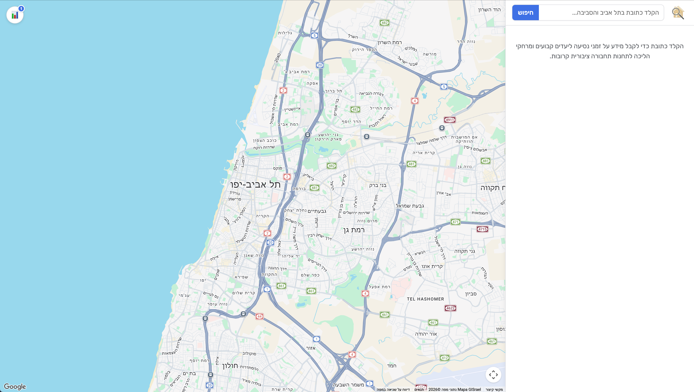
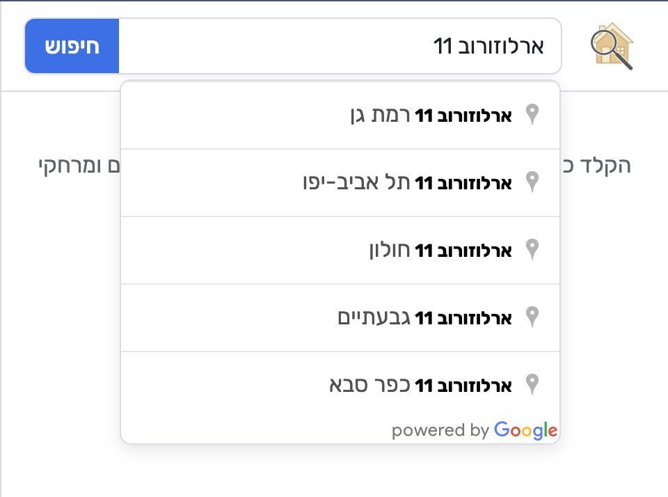
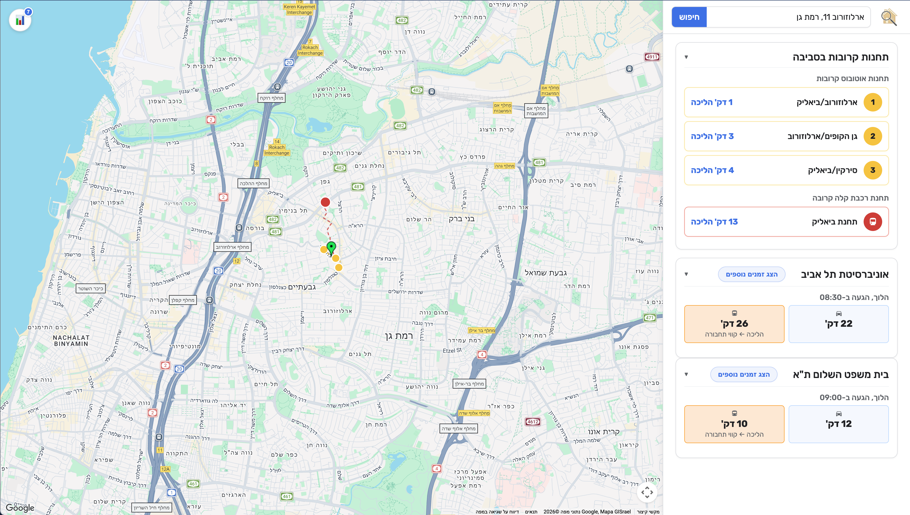
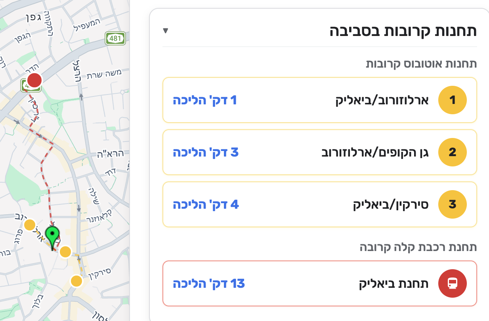
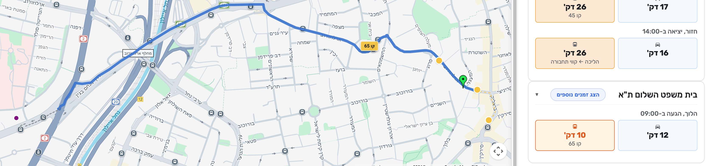
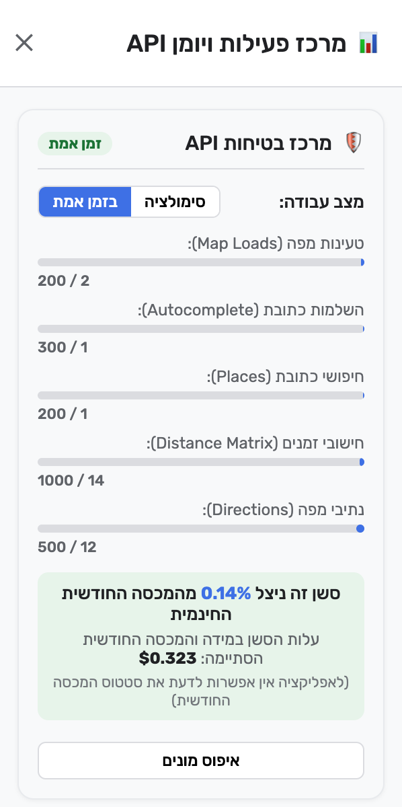

# Location Inspector — Visual Tour

This document showcases every major screen, interaction panel, and feature in the application (could take a few seconds to load properly).

> [Back to Main README](README.md)

---

## 1. Initial View (Before Any Search)
 
*How the app looks when you first open it: a clean interactive map of Tel Aviv & Gush Dan with an empty search box ready for an address.*

---

## 2. Address Search
 
*Type any address (English or Hebrew) to get instant suggestions (autocomplete) powered by Google Maps Places API.*

---

## 3. Full Location Inspector Dashboard (Main View)
 
*The main application dashboard, with the **green marker showing the exact address**. On display as well are the closest bus stations (marked in yellow), the closest light rail (Dankal) station (marked in red), and the walking routes to each station.*

---

## 4. Nearby Bus & Light Train (Dankal) Stations
 
*Shows the 3 closest bus stops and nearest light rail (Dankal) station, with exact walking durations in minutes. The panel on the right is clickable and clicking the bus or light rail stations will show/hide them on the map.*

---

## 5. Commutes to the Set Locations *(Tel Aviv University & Tel Aviv Courthouse)*
 
The panel on the right displays commute options from the set locations (currently Tel Aviv University and Tel Aviv Courthouse). 

For each location, there are driving routes (blue buttons) and public transport routes (orange buttons), with 1 for each displayed at the start and an `הצג זמנים נוספים` button to view more times (and directions, as some of the buttons are set as routes to these locations, and some are set as routes from these locations towards the chosen address).

When a button is pressed, the route is presented on the map (if its a public transport route, the line numbers are visible on the map). In the photo, you can see that the public transport button to the courthouse (9AM arrival time) is pressed and the route is displayed on the map in blue (line 65, with a short walk at the end).

---

## 6. API Usage & Safety Panel
 
*Keeps track of total API requests, daily quota limits, and estimated billing cost to prevent overusing the API service and incurring unexpected charges.*

